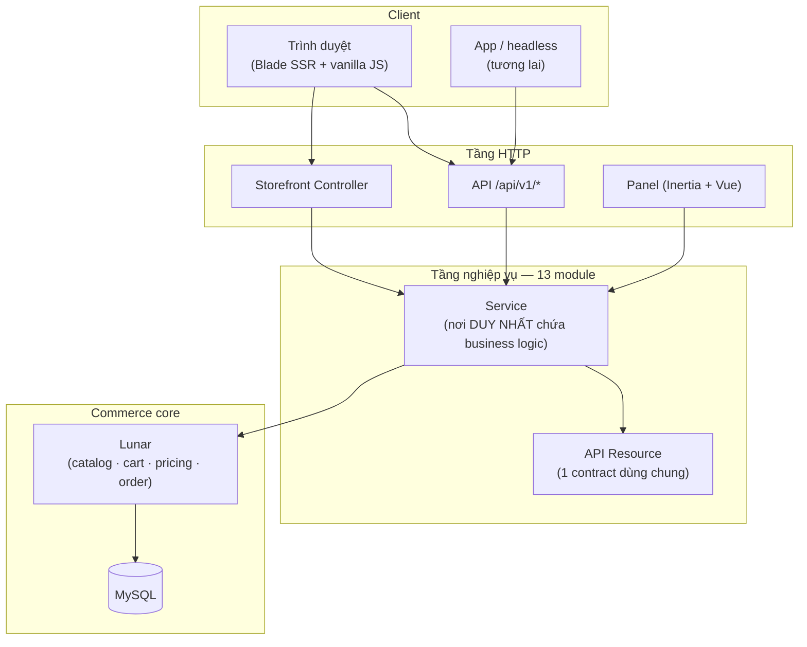
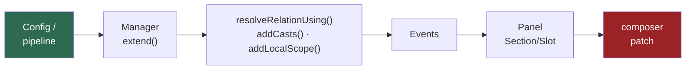

# Lunar Shop — Tài liệu kỹ thuật

Ecommerce fashion cho SME single-store. Laravel 12 + [Lunar](https://lunarphp.io/)
làm commerce core, storefront Blade SSR. Admin đang trong quá trình viết lại
trên `lunarphp/panel` (Inertia + Vue) — xem [guides/upgrade-lunar-2.0.md](guides/upgrade-lunar-2.0.md).

---

## Bắt đầu từ đâu

| Bạn cần | Đọc |
|---|---|
| Hiểu hệ thống có gì, chạy ra sao | [architecture/overview.md](architecture/overview.md) |
| Viết code theo đúng quy tắc dự án | [guides/coding-standards.md](guides/coding-standards.md) |
| Sửa giao diện storefront | [architecture/theme.md](architecture/theme.md) |
| Chạy lệnh artisan thường dùng | [guides/commands.md](guides/commands.md) |
| Lỗi chỉ xảy ra trong trình duyệt | [guides/e2e-testing.md](guides/e2e-testing.md) |
| Deploy & vận hành production | [guides/deployment.md](guides/deployment.md) |
| Hiểu đợt nâng Lunar 1.5 / Filament v4 đã làm gì (lịch sử) | [guides/upgrade-lunar-1.5.md](guides/upgrade-lunar-1.5.md) |
| Đợt nâng Lunar 2.0 + panel Inertia/Vue: kế hoạch và nhật ký | [guides/upgrade-lunar-2.0.md](guides/upgrade-lunar-2.0.md) |
| Hợp nhất ProductSku → ProductVariant (chặn Fase 4) | [guides/migrate-skus-to-variants.md](guides/migrate-skus-to-variants.md) |
| Hai lỗi của Lunar và cách sống chung | [upstream/README.md](upstream/README.md) |
| Xem việc còn tồn đọng | [roadmap.md](roadmap.md) |

> **Nguồn sự thật về hiện trạng là [architecture/overview.md](architecture/overview.md).**
> Các file khác không lặp lại nó — chúng trả lời câu hỏi khác. Khi thông tin mâu
> thuẫn, overview.md thắng.

---

## Kiến trúc tổng thể



**Điểm mấu chốt:** storefront và API **gọi chung một service + chung một API
Resource**. Không nhân đôi business logic — đó là lý do backend sẵn sàng cho
app/headless mà không phải viết lại.

---

## Ba nguyên tắc chi phối mọi quyết định

### 1. Extend, đừng fork

Lunar là **composer package**, không phải code trong repo. Muốn đổi hành vi thì
dùng điểm mở rộng chính chủ, theo thứ tự ưu tiên từ nhẹ tới nặng:



Càng sang phải càng tốn chi phí bảo trì. `composer patch` là **lựa chọn cuối** —
hiện **không còn dùng lần nào**: bản vá locale fallback đã đi hai chặng, từ
composer patch sang `ModelManifest::replace()` (2026-08-27) rồi sang cast
`FilledTranslations` cài bằng `addCasts()` (2026-09-09), vì **Lunar 2.0 gỡ hẳn
model replacement**. Xem [upstream/README.md](upstream/README.md).

Chi tiết: [architecture/overview.md](architecture/overview.md) §Điểm mở rộng.

### 2. SSR-first cho nội dung SEO

Nội dung công khai cần crawl **render HTML thật ở server**; JS chỉ *enhance*.
Mô hình 3 lớp: SSR shell → hydration payload (cùng shape `/api/v1`) → JS enhance.

**Cấm** render catalog bằng fetch-on-mount. Chi tiết:
[guides/coding-standards.md](guides/coding-standards.md) §8.

### 3. Service-first

Controller mỏng, Blade chỉ format. Business logic sống trong Service — nơi duy
nhất. Chi tiết: [guides/coding-standards.md](guides/coding-standards.md) §4.

---

## Bản đồ module

13 module theo chuẩn [nwidart/laravel-modules](https://laravelmodules.com/) v13,
nạp theo `priority` trong `modules/<Name>/module.json`:


Thứ tự **không tuỳ tiện**: `Notification` phải sau `Order` vì nó lắng nghe domain
event của Order. Đổi thứ tự = sửa `priority`, không sửa code.

Cấu trúc mỗi module (layout v13):

```
modules/<Name>/
├── module.json          # manifest: provider + priority
├── composer.json        # PSR-4 root (merge-plugin)
├── app/                 # Providers, Models, Http, Services…
├── config/
├── database/migrations|seeders/
├── resources/views/
└── routes/
```

---

## Số liệu hiện tại

| Hạng mục | Giá trị |
|---|---|
| Module | 13 |
| File PHP trong `modules/` | 353 |
| Route `api/v1` | 64 |
| Route panel (`lunarphp/panel`) | 370 |
| Test | 560 |

> Số liệu là snapshot lúc viết. Chạy `php artisan test` và
> `php artisan route:list` để lấy con số hiện thời.

---

## Cấu trúc thư mục tài liệu

```
docs/
├── README.md                        # file này — điểm vào
├── roadmap.md                       # việc còn tồn đọng
├── architecture/
│   ├── overview.md                  # nguồn sự thật về hiện trạng
│   └── theme.md                     # theme `fashion`
├── guides/
│   ├── coding-standards.md          # quy tắc viết code
│   ├── commands.md                  # lệnh artisan thường dùng
│   ├── deployment.md                # deploy & vận hành
│   ├── e2e-testing.md               # Dusk — lỗi phía trình duyệt
│   ├── upgrade-lunar-1.5.md         # runbook + nhật ký nâng Lunar 1.3 → 1.5
│   └── upgrade-lunar-2.0.md         # kế hoạch 2.0 + đổi admin sang panel Vue
├── upstream/                        # 2 lỗi upstream + bản vá làm bằng chứng
│   ├── README.md
│   └── *.patch
└── history/
    └── 2026-07-platform-audit.md    # biên bản audit (lịch sử, không phải hiện trạng)
```

**`history/` là tài liệu đóng băng** — snapshot tại thời điểm ghi, cố ý không cập
nhật. Đọc để hiểu *tại sao* một quyết định được đưa ra, không phải để biết hiện
trạng.
